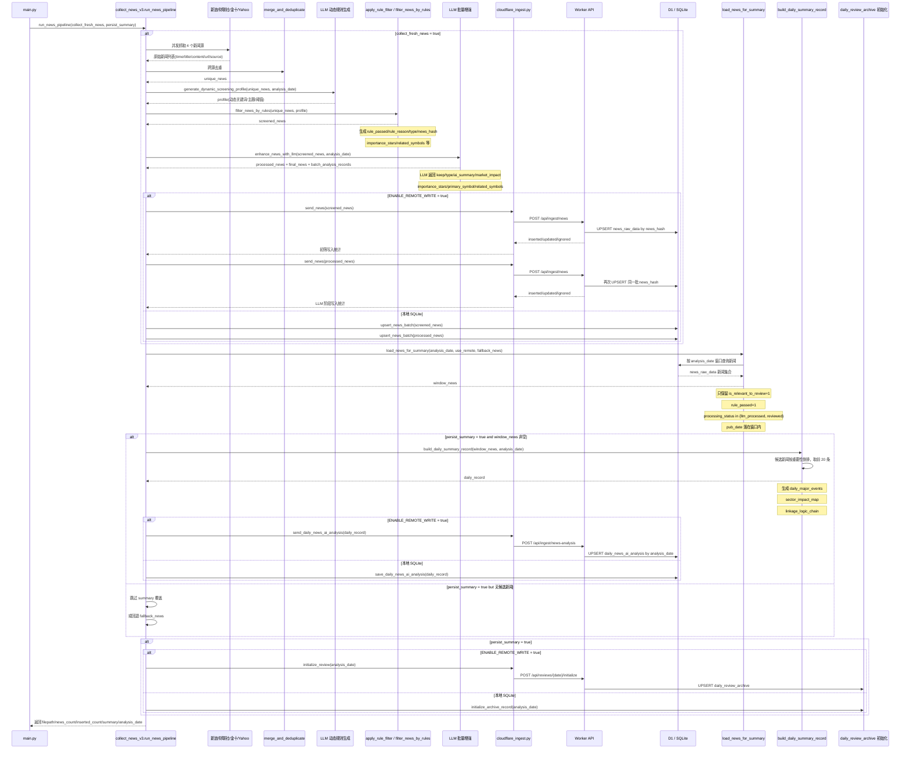

# 新闻采集与落库时序图

本文档梳理本项目新闻链路从采集、筛选、增强、落库到日期级 summary 的完整流程。

```mermaid
sequenceDiagram
    participant Main as main.py
    participant Pipeline as collect_news_v3.run_news_pipeline
    participant Sources as 新浪/财联社/金十/Yahoo
    participant Merge as merge_and_deduplicate
    participant RulesLLM as LLM 动态规则生成
    participant RuleFilter as apply_rule_filter / filter_news_by_rules
    participant BatchLLM as LLM 批量增强
    participant Ingest as cloudflare_ingest.py
    participant Worker as Worker API
    participant Store as D1 / SQLite
    participant SummaryLoad as load_news_for_summary
    participant SummaryLLM as build_daily_summary_record
    participant Archive as daily_review_archive 初始化

    Main->>Pipeline: run_news_pipeline(collect_fresh_news, persist_summary)

    alt collect_fresh_news = true
        Pipeline->>Sources: 并发抓取 4 个新闻源
        Sources-->>Pipeline: 原始新闻列表(time/title/content/url/source)

        Pipeline->>Merge: 跨源去重
        Merge-->>Pipeline: unique_news

        Pipeline->>RulesLLM: generate_dynamic_screening_profile(unique_news, analysis_date)
        RulesLLM-->>Pipeline: profile(动态关键词/主题/阈值)

        Pipeline->>RuleFilter: filter_news_by_rules(unique_news, profile)
        RuleFilter-->>Pipeline: screened_news

        Note over RuleFilter: 生成 rule_passed/rule_reason/type/news_hash
        Note over RuleFilter: importance_stars/related_symbols 等

        Pipeline->>BatchLLM: enhance_news_with_llm(screened_news, analysis_date)
        BatchLLM-->>Pipeline: processed_news + final_news + batch_analysis_records

        Note over BatchLLM: LLM 返回 keep/type/ai_summary/market_impact
        Note over BatchLLM: importance_stars/primary_symbol/related_symbols

        alt ENABLE_REMOTE_WRITE = true
            Pipeline->>Ingest: send_news(screened_news)
            Ingest->>Worker: POST /api/ingest/news
            Worker->>Store: UPSERT news_raw_data by news_hash
            Worker-->>Ingest: inserted/updated/ignored
            Ingest-->>Pipeline: 初筛写入统计

            Pipeline->>Ingest: send_news(processed_news)
            Ingest->>Worker: POST /api/ingest/news
            Worker->>Store: 再次 UPSERT 同一批 news_hash
            Worker-->>Ingest: inserted/updated/ignored
            Ingest-->>Pipeline: LLM 阶段写入统计
        else 本地 SQLite
            Pipeline->>Store: upsert_news_batch(screened_news)
            Pipeline->>Store: upsert_news_batch(processed_news)
        end
    end

    Pipeline->>SummaryLoad: load_news_for_summary(analysis_date, use_remote, fallback_news)
    SummaryLoad->>Store: 按 analysis_date 窗口查询新闻
    Store-->>SummaryLoad: news_raw_data 新闻集合
    SummaryLoad-->>Pipeline: window_news

    Note over SummaryLoad: 只保留 is_relevant_to_review=1
    Note over SummaryLoad: rule_passed=1
    Note over SummaryLoad: processing_status in {llm_processed, reviewed}
    Note over SummaryLoad: pub_date 落在窗口内

    alt persist_summary = true and window_news 非空
        Pipeline->>SummaryLLM: build_daily_summary_record(window_news, analysis_date)
        SummaryLLM->>SummaryLLM: 候选新闻按重要性倒排，取前 20 条
        SummaryLLM-->>Pipeline: daily_record

        Note over SummaryLLM: 生成 daily_major_events
        Note over SummaryLLM: sector_impact_map
        Note over SummaryLLM: linkage_logic_chain

        alt ENABLE_REMOTE_WRITE = true
            Pipeline->>Ingest: send_daily_news_ai_analysis(daily_record)
            Ingest->>Worker: POST /api/ingest/news-analysis
            Worker->>Store: UPSERT daily_news_ai_analysis by analysis_date
        else 本地 SQLite
            Pipeline->>Store: save_daily_news_ai_analysis(daily_record)
        end
    else persist_summary = true but 无候选新闻
        Pipeline->>Pipeline: 跳过 summary 覆盖
        Pipeline->>Pipeline: 或回退 fallback_news
    end

    alt persist_summary = true
        alt ENABLE_REMOTE_WRITE = true
            Pipeline->>Ingest: initialize_review(analysis_date)
            Ingest->>Worker: POST /api/reviews/{date}/initialize
            Worker->>Archive: UPSERT daily_review_archive
        else 本地 SQLite
            Pipeline->>Archive: initialize_archive_record(analysis_date)
        end
    end

    Pipeline-->>Main: 返回 filepath/news_count/inserted_count/summary/analysis_date
```
