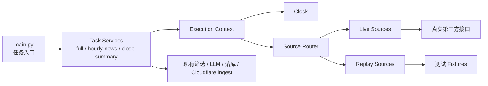

# 时间抽象与数据源抽象技术设计文档

最后更新：2026-03-16  
状态：已完成 3 轮设计与架构评审  
适用范围：`main.py`、新闻采集链路、价格采集链路、周级集成测试主函数

## 1. 文档目标

本文档定义本项目在“周级集成测试”场景下的两项基础设施改造方案：

- 时间抽象
- 数据源抽象

目标不是重写整个采集系统，而是在保持当前主链路稳定的前提下，为以下能力提供清晰、可维护的架构支撑：

- 当天任务继续走真实第三方接口
- 非当天历史任务可在测试环境下走回放数据
- 集成测试可以通过真实任务入口模拟一周行为
- 生产环境不引入测试逻辑污染

本文档同时记录 3 轮设计与架构评审过程，最终输出评审收敛后的方案。

## 2. 背景与问题定义

结合当前代码与测试结果，问题集中在两类：

### 2.1 时间依赖分散

当前代码在多个位置直接使用系统时间：

- [main.py](/Users/didi/Project/MyFinancialAgent/main.py)
- [collect_news_v3.py](/Users/didi/Project/MyFinancialAgent/collect_news_v3.py)
- [collect_prices.py](/Users/didi/Project/MyFinancialAgent/collect_prices.py)
- [db_utils.py](/Users/didi/Project/MyFinancialAgent/db_utils.py)

直接后果：

- 难以模拟“某一天某一时刻”的任务运行
- 周级集成测试无法通过真实任务入口推进历史时间
- 业务逻辑与运行时环境强耦合

### 2.2 数据源访问与业务逻辑耦合

新闻采集当前直接在业务模块中调用外部源：

- 新浪
- 财联社
- 金十
- Yahoo Finance

价格采集当前直接依赖 `yfinance`。

直接后果：

- 非当天历史集成测试无法优雅切换到回放模式
- 测试逻辑容易通过 `if APP_ENV == test` 散落到业务代码中
- 难以清晰区分生产运行与测试运行的输入边界

### 2.3 周级集成测试需求升级

当前测试规范已经明确：

- 测试环境集成测试需要足够的历史辅助数据
- 周级集成测试应逐步演进为：
  - 支持统一虚拟时间
  - 支持非当天新闻接口 mock / 回放
  - 让历史日期也真正通过任务入口推进

相关文档：

- [TESTING_STANDARD.md](/Users/didi/Project/MyFinancialAgent/tests/standards/TESTING_STANDARD.md)
- [INTEGRATION_TEST_SPEC.md](/Users/didi/Project/MyFinancialAgent/tests/cases/integration/INTEGRATION_TEST_SPEC.md)
- [run_weekly_integration.py](/Users/didi/Project/MyFinancialAgent/tests/cases/integration/run_weekly_integration.py)

## 3. 设计原则

本方案必须满足以下原则：

### 3.1 生产逻辑优先稳定

- 生产环境默认只走真实时间与真实数据源
- 不允许将集成测试特化逻辑散落到生产主流程

### 3.2 抽象层级适度

- 只抽象“运行时边界”和“采集输入边界”
- 不重构 LLM、筛选、落库、Workers ingest 等后续链路

### 3.3 任务入口保持不变

以下入口继续保留：

- `python main.py full`
- `python main.py hourly-news`
- `python main.py close-summary`

周级集成测试必须围绕这些入口推进，而不是通过直接写最终表替代任务。

### 3.4 模块职责明确

- 时间模块只负责“当前时间是什么”
- 数据源模块只负责“输入数据从哪里来”
- 任务模块只负责编排业务动作

### 3.5 注释服务于架构理解

新增模块中的注释只解释：

- 模块职责
- 边界
- 为什么存在
- 为什么不放在别处

避免逐行流水账式注释。

### 3.6 非目标

本次设计明确不做以下事情：

- 不重写新闻筛选规则与 LLM 增强逻辑
- 不改造 Cloudflare Worker API 契约
- 不将 SQLite 与 D1 的持久化层统一重构为新仓储层
- 不引入复杂插件系统或动态注册中心
- 不在本轮中解决所有历史 fixture 的自动生成问题

这样做的目的是控制改造范围，确保当前阶段聚焦“时间与输入边界”。

## 4. 最终方案概览

最终推荐方案由两条主线组成：

1. 时间抽象：统一时钟接口
2. 数据源抽象：统一采集输入接口

整体结构如下：



### 4.1 核心决策

- 统一时间来源：所有“当前时间”都通过 `Clock`
- 统一输入来源：新闻与价格都通过 `Source Router`
- 当天测试：走 `live`
- 非当天周级集成测试：走 `replay`
- 生产环境：永远 `live + system clock`

## 5. 模块设计

## 5.1 运行时上下文模块

建议新增目录：

- [runtime/](/Users/didi/Project/MyFinancialAgent/runtime)

建议文件：

- [runtime/context.py](/Users/didi/Project/MyFinancialAgent/runtime/context.py)
- [runtime/clock.py](/Users/didi/Project/MyFinancialAgent/runtime/clock.py)

### 5.1.1 `clock.py`

职责：

- 统一提供“当前时间”能力
- 屏蔽系统时间与测试虚拟时间差异

建议接口：

```python
class Clock:
    def now(self) -> datetime: ...
    def today(self) -> date: ...
    def now_in_tz(self, tz_name: str) -> datetime: ...
```

建议实现：

- `SystemClock`
- `FixedClock`

### 5.1.2 `context.py`

职责：

- 统一读取环境变量
- 为一次任务运行构造完整上下文

建议数据结构：

```python
@dataclass(frozen=True)
class ExecutionContext:
    app_env: str
    test_mode: str
    data_mode: str
    fake_now: datetime | None
    replay_root: Path | None
    clock: Clock
```

建议字段说明：

- `app_env`：`local | test | prod`
- `test_mode`：`none | integration_weekly`
- `data_mode`：`live | replay | hybrid`
- `fake_now`：测试时指定的虚拟时间
- `replay_root`：回放 fixture 根目录
- `clock`：统一时钟对象

### 5.1.3 设计理由

- 当前项目最基础的问题不是“抓取器不够抽象”，而是“时间与运行环境没有中心”
- 先收口上下文，后续数据源路由才能保持清晰

## 5.2 数据源抽象模块

建议新增目录：

- [data_sources/](/Users/didi/Project/MyFinancialAgent/data_sources)

建议文件：

- [data_sources/news_base.py](/Users/didi/Project/MyFinancialAgent/data_sources/news_base.py)
- [data_sources/news_live.py](/Users/didi/Project/MyFinancialAgent/data_sources/news_live.py)
- [data_sources/news_replay.py](/Users/didi/Project/MyFinancialAgent/data_sources/news_replay.py)
- [data_sources/news_router.py](/Users/didi/Project/MyFinancialAgent/data_sources/news_router.py)
- [data_sources/price_base.py](/Users/didi/Project/MyFinancialAgent/data_sources/price_base.py)
- [data_sources/price_live.py](/Users/didi/Project/MyFinancialAgent/data_sources/price_live.py)
- [data_sources/price_replay.py](/Users/didi/Project/MyFinancialAgent/data_sources/price_replay.py)
- [data_sources/price_router.py](/Users/didi/Project/MyFinancialAgent/data_sources/price_router.py)

### 5.2.1 抽象边界

这里的“数据源抽象”只负责输入，不负责：

- 动态规则生成
- 新闻筛选
- LLM 增强
- SQLite / D1 写入
- Review 初始化

也就是说，抽象只放在“拿到原始新闻列表”和“拿到原始价格列表”之前。

### 5.2.2 新闻接口

建议接口：

```python
class NewsSource:
    def fetch_all(self, context: ExecutionContext) -> list[dict]:
        ...
```

实现：

- `LiveNewsSource`
- `ReplayNewsSource`
- `RouterNewsSource`

### 5.2.3 价格接口

建议接口：

```python
class PriceSource:
    def fetch_all(self, context: ExecutionContext) -> list[dict]:
        ...
```

实现：

- `LivePriceSource`
- `ReplayPriceSource`
- `RouterPriceSource`

### 5.2.4 `live` 实现

职责：

- 封装当前真实抓取逻辑
- 尽量复用现有函数，不改变抓取行为

对应迁移来源：

- [collect_news_v3.py](/Users/didi/Project/MyFinancialAgent/collect_news_v3.py)
- [collect_prices.py](/Users/didi/Project/MyFinancialAgent/collect_prices.py)

### 5.2.5 `replay` 实现

职责：

- 从 fixture 读取标准化后的历史输入
- 不再访问第三方 HTTP / `yfinance`

### 5.2.6 `router` 实现

职责：

- 根据 `ExecutionContext` 选择 `live / replay / hybrid`
- 对上层隐藏具体来源差异

## 5.3 Fixture 设计

建议目录：

- [tests/cases/fixtures/replay/](/Users/didi/Project/MyFinancialAgent/tests/cases/fixtures/replay)

建议结构：

- [tests/cases/fixtures/replay/news/](/Users/didi/Project/MyFinancialAgent/tests/cases/fixtures/replay/news)
- [tests/cases/fixtures/replay/prices/](/Users/didi/Project/MyFinancialAgent/tests/cases/fixtures/replay/prices)

建议命名：

- `news/2026-03-10/09-00.json`
- `news/2026-03-10/15-00.json`
- `news/2026-03-10/21-30.json`
- `prices/2026-03-10/close.json`

### 5.3.1 数据粒度

主路径 fixture 建议保存“标准化后的采集结果”，而不是原始 HTML / 原始接口响应。

新闻字段建议：

- `time`
- `title`
- `content`
- `url`
- `source`

价格字段建议：

- `k_date`
- `stock_code`
- `stock_name`
- `symbol`
- `current_price`
- `change_percent`
- `volume`
- `captured_at`

### 5.3.2 为什么不用原始 HTTP 回放作为主路径

原因：

- 当前项目主要目标是“周级系统行为模拟”
- 原始 HTML / JSON 回放更适合 parser 专项测试
- 如果直接把原始 HTTP 回放当主路径：
  - 维护成本高
  - 与页面结构耦合更强
  - 会拖慢当前集成测试改造

结论：

- 周级集成测试主路径：标准化结果回放
- Parser / 抓取器专项测试：可另建原始响应 fixture

## 5.4 任务服务接入方式

为避免让 [main.py](/Users/didi/Project/MyFinancialAgent/main.py) 承担过多逻辑，建议逐步引入任务服务层。

建议目录：

- [services/tasks/](/Users/didi/Project/MyFinancialAgent/services/tasks)

建议文件：

- [services/tasks/full_job.py](/Users/didi/Project/MyFinancialAgent/services/tasks/full_job.py)
- [services/tasks/hourly_news_job.py](/Users/didi/Project/MyFinancialAgent/services/tasks/hourly_news_job.py)
- [services/tasks/close_summary_job.py](/Users/didi/Project/MyFinancialAgent/services/tasks/close_summary_job.py)

### 5.4.1 设计目标

- `main.py` 保持为 CLI 入口
- 任务服务接收 `ExecutionContext`
- 任务服务内部调用：
  - `Clock`
  - `Source Router`
  - 现有业务链路

### 5.4.2 过渡策略

初期不需要一次性拆出全部 service 文件。

可以先做：

- `main.py` 构造 `ExecutionContext`
- `collect_news_v3.py` 和 `collect_prices.py` 接收可选 context

当这两条链路稳定后，再把任务服务层显式拆出。

## 6. 环境策略

建议仅使用少量稳定配置：

- `APP_ENV`
- `TEST_MODE`
- `DATA_MODE`
- `FAKE_NOW`
- `REPLAY_ROOT`

### 6.1 建议取值

- `APP_ENV=local|test|prod`
- `TEST_MODE=none|integration_weekly`
- `DATA_MODE=live|replay|hybrid`
- `FAKE_NOW=2026-03-12T09:00:00`
- `REPLAY_ROOT=tests/cases/fixtures/replay`

### 6.2 运行规则

#### 生产环境

- `APP_ENV=prod`
- 强制使用：
  - `SystemClock`
  - `live`

#### 测试环境普通联调

- `APP_ENV=test`
- `TEST_MODE=none`
- 默认：
  - `SystemClock`
  - `live`

#### 周级集成测试

- `APP_ENV=test`
- `TEST_MODE=integration_weekly`
- 使用：
  - `FixedClock`
  - `hybrid`

`hybrid` 路由规则：

- 如果 `fake_now.date()` 等于真实今天：走 `live`
- 如果 `fake_now.date()` 不等于真实今天：走 `replay`

## 7. 代码注释规范

为保证后续代码结构清晰，新增模块采用以下注释规则：

### 7.1 模块头注释

必须说明：

- 本模块职责
- 本模块边界
- 为什么该逻辑放在这里

### 7.2 类注释

必须说明：

- 该类代表什么运行角色
- 适用于哪些环境
- 不负责什么

### 7.3 函数注释

只在以下场景加注释：

- 输入输出不直观
- 有明确边界约束
- 有环境路由或降级逻辑

### 7.4 明确禁止

- 禁止注释解释显而易见的赋值语句
- 禁止写大段实现流水账
- 禁止在每一行上方堆叠重复注释

## 8. 迁移方案

建议分 4 个阶段实施。

### 阶段 1：时间抽象落地

目标：

- 引入 `Clock`
- 收口关键时间来源

涉及文件：

- [runtime/clock.py](/Users/didi/Project/MyFinancialAgent/runtime/clock.py)
- [runtime/context.py](/Users/didi/Project/MyFinancialAgent/runtime/context.py)
- [collect_news_v3.py](/Users/didi/Project/MyFinancialAgent/collect_news_v3.py)
- [collect_prices.py](/Users/didi/Project/MyFinancialAgent/collect_prices.py)
- [main.py](/Users/didi/Project/MyFinancialAgent/main.py)

### 阶段 2：新闻数据源抽象

目标：

- 为新闻采集引入 `live / replay / router`
- 周级集成测试先支持新闻回放

原因：

- 当前周级集成测试的核心难点主要在新闻源
- 优先做新闻能最快释放测试价值

### 阶段 3：周级主函数接入虚拟时间

目标：

- 改造 [run_weekly_integration.py](/Users/didi/Project/MyFinancialAgent/tests/cases/integration/run_weekly_integration.py)
- 让它按 `FAKE_NOW` 推进历史时点
- 非当天走 replay，当天走 live

### 阶段 4：价格数据源抽象

目标：

- 为价格链路增加 `live / replay / router`
- 让整周模拟完全摆脱“历史价格只能靠静态 seed”的限制

### 8.5 向后兼容策略

为避免大面积修改现有业务函数，实施期应采用兼容式接入：

第一阶段建议做法：

- 允许 `collect_news_v3.py` 的公开入口继续保持当前函数名
- 允许 `collect_prices.py` 的公开入口继续保持当前函数名
- 为这些入口增加可选参数 `context=None`
- 当 `context is None` 时：
  - 自动构造默认 `ExecutionContext`
  - 行为与当前版本保持一致

这样可以保证：

- 现有 CLI 入口不需要一次性重写
- GitHub Actions 与本地手动命令不需要立即改动
- 周级集成测试可以优先接入新能力

第二阶段再逐步推动：

- `main.py` 显式构造 `ExecutionContext`
- 任务服务层替代入口内部的隐式上下文构造

## 9. 风险与对策

### 9.1 风险：过度重构

风险：

- 一次性改动太大，影响现有任务稳定性

对策：

- 只抽输入边界
- 不改后续筛选、LLM、入库逻辑
- 按阶段实施

### 9.2 风险：测试逻辑污染生产

风险：

- 测试 replay 逻辑误入生产环境

对策：

- `APP_ENV=prod` 强制 `live`
- 路由集中在 `context + router`
- 不在业务深处散落环境判断

### 9.3 风险：fixture 长期失真

风险：

- 历史 replay 数据不再贴近真实市场情况

对策：

- fixture 用于“系统行为模拟”，不是市场准确性判断
- 定期刷新测试周样本
- 保留当天 live 作为真实链路补偿

### 9.4 风险：评论和文档失控

风险：

- 新增模块多后，注释和文档容易变成噪音

对策：

- 注释仅解释架构边界
- 所有新增模块遵循统一注释规则
- 以本设计文档作为总入口

## 10. 设计与评审循环

## 10.0 三轮评审结果总览

| 轮次 | 评审重点 | 主要问题 | 评审结果 |
| --- | --- | --- | --- |
| 第 1 轮 | 抽象边界是否过大 | 初稿有过度设计倾向，任务服务层过早引入 | 通过，但要求收窄边界，只抽时间与输入层 |
| 第 2 轮 | 环境安全与 replay 粒度 | 生产环境约束不够硬，原始 HTTP 回放成本过高 | 通过，但要求生产强制 live，fixture 主路径改为标准化结果 |
| 第 3 轮 | 可落地性与维护性 | 需要更清晰的迁移步骤、非目标和兼容策略 | 通过，可进入实现阶段 |

## 10.1 第 1 轮设计

初稿方向：

- 时间抽象：统一 `Clock`
- 数据源抽象：新闻与价格均提供 `live / replay / router`
- 周级集成测试通过 `ExecutionContext` 推进

### 第 1 轮高级架构师评审

评审视角：

- 是否过度设计
- 是否会影响现有生产链路
- 是否能在当前项目阶段渐进落地

发现：

1. 初稿如果直接引入完整任务服务层，阶段成本偏高  
2. 如果一开始就把所有业务都强制改为依赖 context，改动面过大  
3. 需要明确“只抽输入边界，不重构筛选与 LLM”

评审结论：

- 保留 `ExecutionContext`
- 任务服务层改为“可选过渡层”，不是第一阶段强制项
- 数据源抽象边界必须收窄到输入层

本轮评审结果：

- 结果：有条件通过
- 通过条件：
  - 第一阶段不强制上任务服务层
  - 不允许把改造范围扩展到 LLM、筛选、落库层
  - 需要在文档中明确“抽象边界”与“非目标”

### 第 1 轮修订

- 将任务服务层从“立即落地”降级为“阶段性演进目标”
- 明确只抽象：
  - 时间
  - 新闻输入
  - 价格输入

## 10.2 第 2 轮设计

第二稿重点：

- 强化环境策略
- 明确 `prod/test/local` 规则
- 明确 `live/replay/hybrid` 切换边界

### 第 2 轮高级架构师评审

评审视角：

- 环境切换是否足够安全
- 生产环境是否存在误切 replay 的风险
- fixture 粒度是否合理

发现：

1. 仅依赖 `TEST_MODE` 不够，必须让 `prod` 具备强约束  
2. 原始 HTTP 回放若作为主路径，维护成本过高  
3. 周级集成测试重点是系统行为，不是 parser 专项

评审结论：

- `APP_ENV=prod` 必须强制 `live`
- fixture 主路径采用“标准化采集结果”
- 原始响应 fixture 只作为未来专项测试补充

本轮评审结果：

- 结果：通过
- 附加决策：
  - 环境策略必须集中在 `ExecutionContext + Router`
  - replay 只对测试环境开放
  - fixture 目录和粒度必须在文档中明确，否则实现容易失控

### 第 2 轮修订

- 在环境策略中明确生产强制 live
- 固化 replay fixture 粒度
- 将 parser 专项测试从本设计主路径中剥离

## 10.3 第 3 轮设计

第三稿重点：

- 补齐迁移路径
- 补齐注释规范
- 补齐风险与边界说明

### 第 3 轮高级架构师评审

评审视角：

- 是否足够模块化
- 是否有清晰迁移步骤
- 是否便于团队后续维护

发现：

1. 方案已经具备清晰模块边界  
2. 迁移路径按“时间 -> 新闻 -> 周级集成 -> 价格”推进较稳  
3. 注释规范与环境策略已能支撑后续持续维护

最终评审结论：

- 方案通过
- 允许进入实现阶段
- 推荐先落地：
  - `runtime/clock.py`
  - `runtime/context.py`
  - `data_sources/news_*`
  - 周级集成测试接入 `FAKE_NOW`

本轮评审结果：

- 结果：正式通过
- 输出要求：
  - 设计文档可作为实现基线
  - 后续代码提交应对照本设计文档执行
  - 第一阶段实现完成后，再做一次“实现偏差评审”

## 11. 最终建议

本项目采用以下最终方案：

1. 先做时间抽象  
2. 再做新闻数据源抽象  
3. 用 `ExecutionContext + FAKE_NOW + replay fixture` 改造周级集成测试  
4. 最后做价格数据源抽象  

这是当前在“整洁度、模块化、环境安全、落地成本”之间最平衡的方案。
